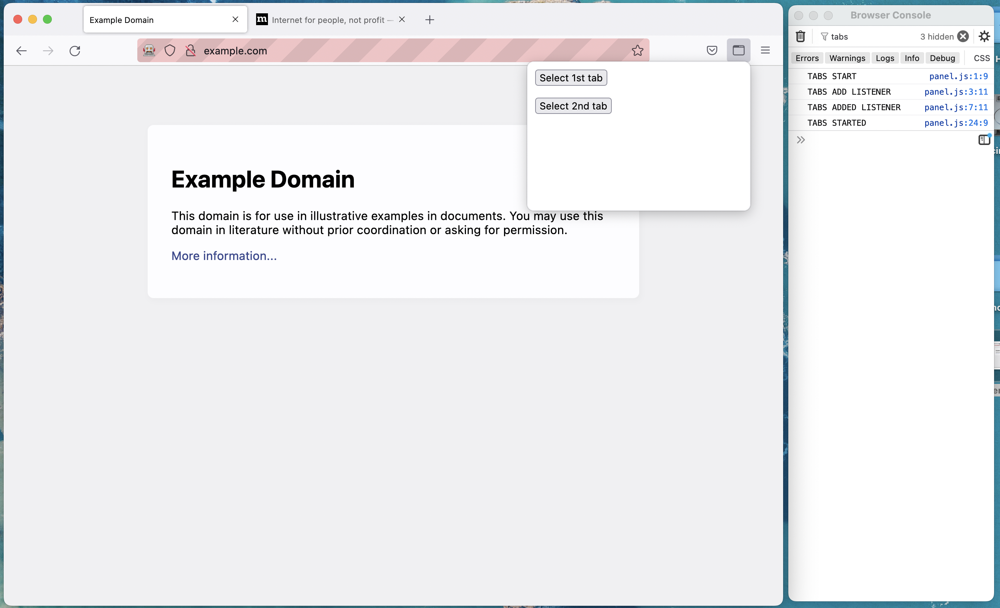

Mozilla bug minimal reproducible demo for https://bugzilla.mozilla.org/show_bug.cgi?id=1779926

How to debug:

- Install npm dependencies
  #: npm install
- Run extension with web ext
  #: npm run run
- Open two tabs with arbitrary urls (example.com and mozilla.org for example)
- Open Browser Console (on mac it is located in Tools -> Browser Tools -> Browser Console (shift-cmd-J))
- Filter messages by "TABS"
- Open extension panel by clicking extension icon in the top right corner of Firefox.
- In browser console you should see "TABS START", "TABS ADD LISTENER", "TABS ADDED LISTENER", "TABS STARTED" messages.
- Try to switch between tabs with buttons on extension panel: Select 1st tab, Select 2nd tab.
- If you try it on Firefox < 101, you should see "TABS UPDATED" message. On Firefox >= 101 message is absent, which indicates that browser.tabs.onUpdated listener not called.
- Code for extension panel is located in ext/dist/panel.js

